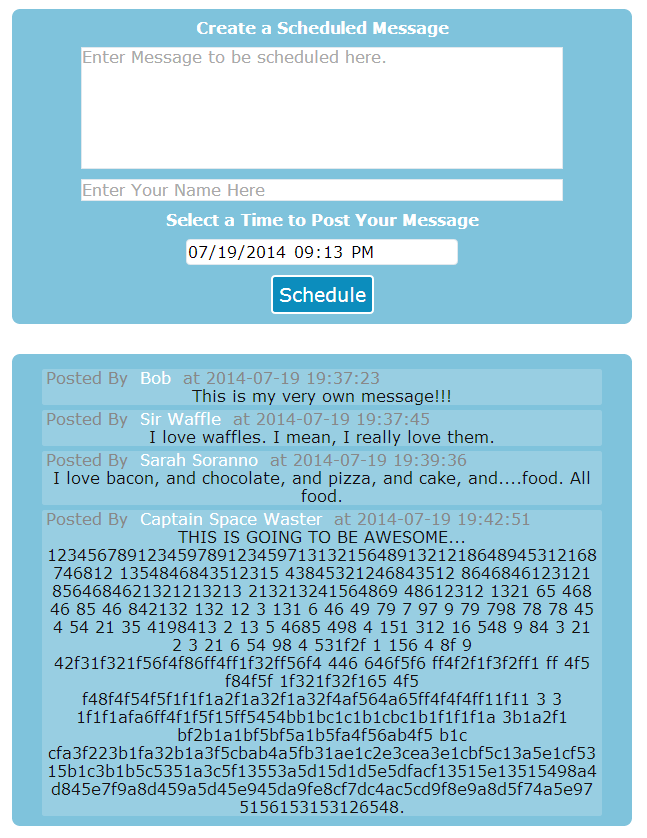

psched-main
===========
The user interface server/feed viewer for my php message scheduler project

## Description
This is the main server, which acts as the user hub. It has an area where you can schedule messages to be sent later(internally this add a message to the queue on a psched-dispatcher server). It also has an area that works like a "feed", showing all messages and when they were posted.

The main server posts messages, but the user is not able to do it via a standard interface. Instead they just schedule them. They are queued on the dispatcher server, which will later ask the main server to post them to the via a POST request. The time displayed on a post is not the scheduled time, but the post time.

## Screenshots

## Backend Interface By Example
`curl --data "username=Curl&message=I'm posting directly from Curl!" localhost/postMessage.php`

`curl --data "username=Curl&message=I'm scheduling a message!&time=2014-08-01T13:30:00" localhost/scheduleMessage.php`

